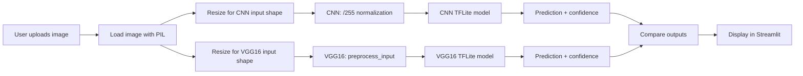

# 🐈 Cat vs 🐕 Dog — Image Classification

An end-to-end binary image classification project that compares two deep learning approaches for classifying cats and dogs:

1. A custom CNN trained from scratch.
2. A VGG16 transfer learning model using ImageNet pretrained weights.

Both trained models are converted to TensorFlow Lite and served inside a Streamlit application that lets the user upload an image and compare the predictions and confidence scores of both models side by side.

---

## Overview

This project covers the full workflow of a small computer vision system:

- Loading and indexing the dataset into a Pandas DataFrame.
- Stratified train / validation / test splitting.
- Training two independent models: a custom CNN and a VGG16 transfer learning model.
- Converting both models to TensorFlow Lite for lightweight inference.
- Serving the models through a Streamlit app that runs the same image through both models and compares their outputs.

The goal is not to declare a "winner" between the two approaches, but to demonstrate the pipeline from raw images to a working inference application, and to compare how a from-scratch CNN and a pretrained VGG16 behave on the same task.

---

## Models

| Model | Type | Backbone | Pretrained | Trainable base |
|---|---|---|---|---|
| Custom CNN | From scratch | — | No | — |
| VGG16 | Transfer learning | VGG16 (ImageNet) | Yes | Frozen |

Both models output a 2-class softmax distribution: `[Cat, Dog]`.

---

## Dataset

**Dataset:** `bhavikjikadara/dog-and-cat-classification-dataset`

**Structure:**

```text
PetImages/
├── Cat/
└── Dog/
```

The dataset is loaded into a Pandas DataFrame with two columns:

- `image` — full file path to the image.
- `label` — class name (`Cat` or `Dog`).

**Splitting:**

The data is split using stratified `train_test_split` with `random_state=42`:

- 80% training
- 20% held out from the first split
- The held-out portion is split again 50/50 into validation and test, resulting in approximately:
  - **72% train**
  - **8% validation**
  - **20% test**

Stratification is applied on the `label` column at every step.

```python
from sklearn.model_selection import train_test_split

train_df, temp_df = train_test_split(
    df, test_size=0.2, stratify=df["label"], random_state=42
)
val_df, test_df = train_test_split(
    temp_df, test_size=0.5, stratify=temp_df["label"], random_state=42
)
```

---

## Data Preprocessing and Augmentation

Preprocessing is **model-specific**:

- **Custom CNN** → resize → normalize with `image_array / 255.0`
- **VGG16** → resize → `preprocess_input` from `tensorflow.keras.applications.vgg16`

VGG16 preprocessing is **not** simple `/255` normalization. It applies the ImageNet preprocessing function, which is required for the pretrained weights to behave as expected.

### CNN augmentation (training only)

```python
ImageDataGenerator(
    rescale=1./255,
    rotation_range=20,
    width_shift_range=0.1,
    height_shift_range=0.1,
    horizontal_flip=True,
)
```

### VGG16 augmentation (training only)

```python
ImageDataGenerator(
    preprocessing_function=preprocess_input,
    rotation_range=20,
    width_shift_range=0.1,
    height_shift_range=0.1,
    horizontal_flip=True,
    zoom_range=0.1,
)
```

Validation and test generators use only the preprocessing step (no augmentation).

---

## CNN Architecture

**Input:** `224 × 224 × 3`

```text
Input (224, 224, 3)
↓
Conv2D(32, 3×3, padding="same", activation="relu")
↓
MaxPooling2D(2×2)
↓
Conv2D(64, 3×3, padding="same", activation="relu")
↓
MaxPooling2D(2×2)
↓
Conv2D(128, 3×3, padding="same", activation="relu")
↓
MaxPooling2D(2×2)
↓
GlobalAveragePooling2D
↓
Dense(128, activation="relu")
↓
Dropout(0.3)
↓
Dense(2, activation="softmax")
```

---

## VGG16 Transfer Learning Architecture

**Input:** `224 × 224 × 3`

The VGG16 base is loaded with ImageNet weights and no classifier head, and is frozen during training:

```python
from tensorflow.keras.applications import VGG16

base_model = VGG16(
    weights="imagenet",
    include_top=False,
    input_shape=(224, 224, 3)
)
base_model.trainable = False
```

**Classifier head:**

```text
VGG16 (frozen)
↓
GlobalAveragePooling2D
↓
Dense(256, activation="relu")
↓
BatchNormalization
↓
Dropout(0.5)
↓
Dense(2, activation="softmax")
```

---

## Training Configuration

Both models share the same training configuration.

| Setting | Value |
|---|---|
| Epochs | 15 |
| Batch size | 32 |
| Optimizer | Adam |
| Learning rate | 0.001 |
| Loss | categorical_crossentropy |
| Metric | accuracy |

```python
model.compile(
    optimizer=Adam(learning_rate=0.001),
    loss="categorical_crossentropy",
    metrics=["accuracy"]
)
```

---

## TensorFlow Lite Conversion

After training, both Keras models are converted to TensorFlow Lite using:

```python
import tensorflow as tf

converter = tf.lite.TFLiteConverter.from_keras_model(model)
tflite_model = converter.convert()

with open("cat_dog_model_cnn.tflite", "wb") as f:
    f.write(tflite_model)
```

The same process is applied to the VGG16 model, producing:

```text
models/
├── cat_dog_model_cnn.tflite
└── cat_dog_model_vgg.tflite
```

TensorFlow Lite is used because it provides a small, portable format for inference. The Streamlit application loads the `.tflite` files directly and runs inference on the uploaded image, without requiring the full Keras/TensorFlow training stack.

---

## Streamlit Application

The app allows the user to upload an image (JPG, JPEG, PNG) and see:

- CNN prediction
- CNN confidence
- VGG16 prediction
- VGG16 confidence
- Whether both models agree or disagree

The application runs the same image through both TensorFlow Lite models.

```text
app/
├── app.py
└── helpers.py
```

### Dynamic input shape handling

The exported TensorFlow Lite models may have different input dimensions. For example, the CNN `.tflite` model may expect `160 × 160`, while VGG16 expects `224 × 224`.

To handle this, `helpers.py` reads the input shape of each TensorFlow Lite model dynamically, and the preprocessing code resizes the uploaded image according to each model's actual input shape, rather than assuming one fixed size.

Preprocessing remains model-specific:

```text
CNN   → resize → /255
VGG16 → resize → preprocess_input
```

---

## Inference Pipeline



---

## Project Structure

```text
PetImages/
│
├── app/
│   ├── app.py
│   └── helpers.py
│
├── models/
│   ├── cat_dog_model_cnn.tflite
│   └── cat_dog_model_vgg.tflite
│
├── notebooks/
│   └── cats-dogs.ipynb
│
├── requirements.txt
└── README.md
```

---

## Installation

Clone the repository and install the dependencies:

```bash
git clone https://github.com/<your-username>/<your-repo>.git
cd <your-repo>
pip install -r requirements.txt
```

**`requirements.txt` includes (at minimum):**

```text
tensorflow
streamlit
numpy
pandas
pillow
scikit-learn
matplotlib
```

---

## Running the Application

From the repository root:

```bash
streamlit run app/app.py
```

Then open the URL printed in the terminal (usually `http://localhost:8501`), upload a JPG, JPEG, or PNG image, and the app will display the prediction and confidence for both the CNN and VGG16 models, along with whether the two models agree.

---

## Evaluation

This project does not report accuracy, precision, recall, F1-score, or benchmark comparisons between the two models. Any such metrics should be produced from the actual evaluation run of the trained models on the test split, and added here once available.

The intended evaluation setup is:

- Evaluate both models on the same stratified test split.
- Report confusion matrices and classification reports per model.
- Compare predictions on the same inputs through the Streamlit app.

---

## Technologies Used

- **Python**
- **TensorFlow / Keras** — model building and training
- **VGG16 (ImageNet weights)** — transfer learning backbone
- **TensorFlow Lite** — model conversion and lightweight inference
- **Streamlit** — interactive web application
- **Pandas** — dataset indexing and DataFrame handling
- **NumPy** — array operations
- **scikit-learn** — stratified train/val/test splitting
- **Pillow (PIL)** — image loading in the app
- **Matplotlib** — training curves and visualization

---

## What I Learned / What the Project Demonstrates

- Building an end-to-end image classification pipeline, from raw folder structure to a working inference app.
- The practical difference between training a CNN from scratch and using a pretrained backbone with transfer learning.
- The importance of matching the preprocessing pipeline to the model. VGG16 requires `preprocess_input`, not `/255` normalization.
- How to convert Keras models to TensorFlow Lite and run inference on them outside the training environment.
- How to handle dynamic input shapes when serving multiple models with different input dimensions in one application.
- Serving two models side by side in a Streamlit app and comparing their predictions and confidence scores on the same input.

---

## Future Improvements

- Add a fine-tuning stage for VGG16 (unfreeze the last convolutional block and retrain with a small learning rate).
- Add quantitative evaluation: confusion matrices and classification reports for both models on the test split.
- Add a comparison view that highlights disagreement cases and shows both models' confidence for those.
- Add support for more classes beyond cat and dog.
- Add optional INT8 or FP16 quantization during TensorFlow Lite conversion for smaller model size.
- Add automated tests for the preprocessing and inference helpers.
- Add a small set of sample images for quick testing of the app.

---

## Author

**<Your Name>**
GitHub: [@AbdoTechno](https://github.com/AbdoTechno)